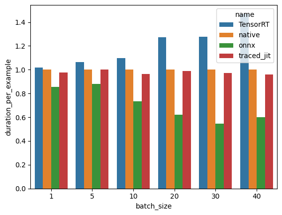

# Inference Benchmarks

Code for benchmarking different inference frameworks on specific models using different batch sizes.

For a BERT-like sentiment classification model, the comparison of different exported models against natively running the benchmark on the dataset is shown below:



## TensorRT

`tensor_rt.py` contains the classes needed to export a onnx model to TensorRT and how to do inference on the TensorRT model including handling the memory transport of data between the CPU and GPU.

## To get started

To run the benchmark, you will need to set up the `BenchmarkModel`. `BenchmarkModel` wraps the underlying PyTorch model and sets up some basics about the input to the model needed to export the model to ONNX, traced JIT script, TensorRT...

### Classification models from Hugging Face

If you want to benchmark a text classification model from Hugging Face, you can use TextClassification directly.

```python
model = TextClassification(
    model_name=<NAME_OF_MODEL>,
    torchscript=True
)
```

### Generic model 

If you want to benchmark a generic model, you will need to implement `export_to_onnx`, `export_to_tensorrt`, and `export_to_traced_jit`. In those functions, you will supply the `BenchmarkModel`'s implementation of those functions with the specification for the input data.

```python
class ModelToBenchmark(BenchmarkModel):
    def __init__(
        self,
        **kwargs
    ):
        # Init the model
        ...
        super().__init__(model, model_name)
        
    def export_to_onnx(self, device: str,  dynamic_axis: bool = True):
        ....
        return super().export_to_onnx(
            dummy_input, # Dict of example inputs to the model Dict[str, torch.Tensor]
            dynamic_axis, # Which axis are going to be dynamic?
            device=device,
        )
    
    def export_to_tensorrt(
        self,
        max_batch_size: int = 100,
        device: str = "cuda",
    ):
        ...
        return super().export_to_tensorrt(
            min_shape=min_shape, # Minimum shape to the model
            opt_shape=opt_shape, # Optimized shape to the model
            max_shape=max_shape,  # Max shape to the model
            names=["input_ids", "attention_mask"],
        )
    
    def export_to_traced_jit(self, device: str):
        return super().export_to_traced_jit(
            dummy_input, # Dict of example inputs to the model Dict[str, torch.Tensor]
            device=device,
        )
    
    def export_to_native(self, device: str):
        return super().export_to_native(
            device=device,
        )
```


Benchmarks of different optimized inference engines for DL-models


## Benchmarking - inference time 

Set up the Benchmarking class, 

```python
benchmark = Benchmark(
    dataset="carblacac/twitter-sentiment-analysis",
    batch_sizes=[1, 5, 10, 20, 30, 40],
    dataset_process_callback=dataset_process,
    data_item_process_callback=dataset_item_callback.process
)
```

where `batch_sizes` is a list of batch_sizes that we want to run the benchmarking on. ```dataset_process_callback``` implements a callback function whenever we setup the dataset that we are going to benchmark on.

```python
def dataset_process(dataset):
    return dataset["train"].select(range(5000))
```

whereas ```DatasetItemCallbackNLP``` implements the callback function that processes each loaded batch from the dataset.

```python
class DatasetItemCallbackNLP():
    def __init__(self, tokenizer):
        self._tokenizer = tokenizer
    def process(self, batch: List[Dict[str, Any]]):
        ...
        return tokens
```

We can now run through the dataset using the different exported models,

```python
duration_onnx = benchmark.excecute(
    model.export_to_onnx("cuda"),
    name="onnx"
)

duration_tensorrt = benchmark.excecute(
    model.export_to_tensorrt(max_batch_size=40),
    name="TensorRT"
)

```

